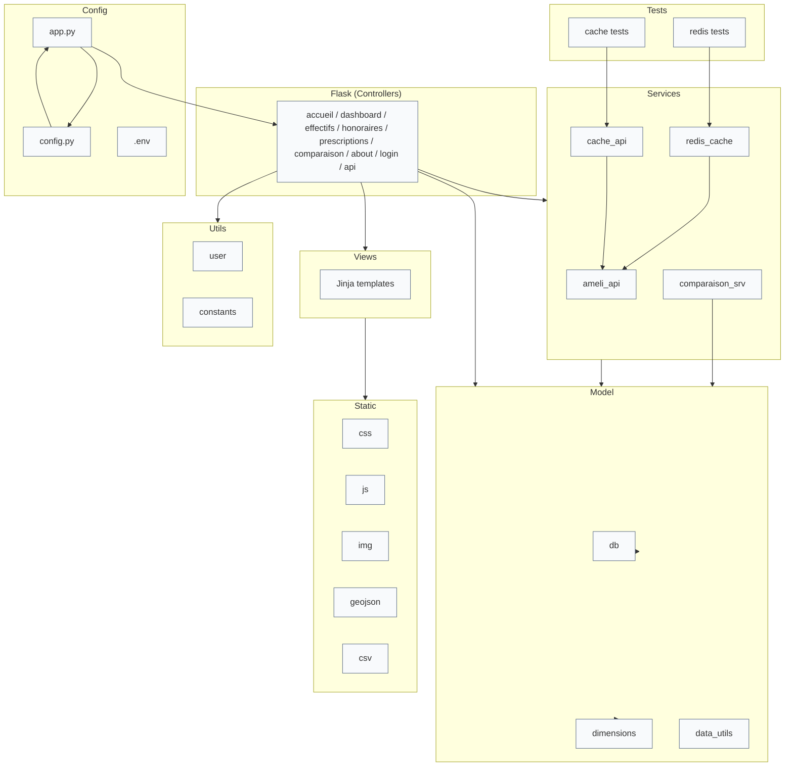

# SAE 2.01 - Développement d'une Application Web Flask

## Présentation

Cette SAE (Situation d'aprentissage évalué, ie un projet académique) consiste à développer une application web complète à partir de la base de données réalisée lors de la SAE 2.04.

L'application permet d'exploiter des données de l'Assurance Maladie à travers une interface web interactive intégrant :

- Consultation de données statistiques
- Visualisations graphiques dynamiques
- Comparaison de territoires
- Export CSV
- API REST JSON
- Architecture MVC

## Objectifs pédagogiques

- Mettre en œuvre une architecture MVC
- Développer une application web avec Flask
- Utiliser SQLAlchemy pour l'accès aux données
- Créer des interfaces dynamiques avec Jinja2
- Exploiter AJAX et les routes JSON
- Produire des visualisations avec Chart.js
- Déployer une application sur Alwaysdata

---

## Technologies utilisées

|Nom|Fonction|
|:-|:-|
|**Flask 3**|Framework web Python utilisé pour développer l'application et gérer les routes, requêtes HTTP et API.|
|**SQLAlchemy**|ORM permettant d'interagir avec la base de données MySQL via des objets Python plutôt que du SQL brut.|
|**Jinja2**|Moteur de templates utilisé par Flask pour générer dynamiquement les pages HTML.|
|**HTML5**|Langage de balisage utilisé pour structurer le contenu des pages web.|
|**JavaScript**|Langage de programmation côté client utilisé pour rendre l'interface interactive.|
|**Chart.js**|Bibliothèque JavaScript permettant de créer des graphiques dynamiques et interactifs.|
|**MySQL**|Système de gestion de base de données relationnelle utilisé pour stocker les données de l'application.|
|**Bootstrap**|Framework CSS facilitant la création d'interfaces responsives et modernes.|
|**Pandas**|Bibliothèque Python utilisée pour la manipulation, l'analyse et le traitement des données.|

---

## Structure du projet

## Architecture de l'application

---



---

## Fonctionnalités

### Consultation des données

Consultation sur les jeux de données suivants:

- Effectifs par spécialité, département et année
- Montant des prescription par spécialité, département et année
- Effectifs par spécialité, département et année
- Un dashboard qui affiche un ensemble d'information
- Une page permettent la comparaison entre deux jeux de données

### Cascade AJAX

Lorsqu'une région est sélectionnée :

1. Un appel AJAX est effectué.
2. Flask retourne les départements correspondants.
3. La liste des départements est mise à jour sans rechargement de page.

### Visualisations Chart.js

#### Courbe d'évolution

- Évolution des effectifs dans le temps
- Affichage dynamique des données

#### Diagramme en bar

- Comparaison entre deux jeux de données
- Affichage

#### Carte choroplèthe

- Comparaison entre deux territoires
- Affichage simultané sur un même graphique

### API REST

Routes JSON permettant d'alimenter les graphiques :

```http
GET /api/departements/<id_region>
GET /api/effectifs/<id_departement>
GET /api/honoraires/<id_departement>
```

### Export CSV

Téléchargement des résultats sous format CSV.

Exemple :

```csv
Annee,Effectif
2018,1200
2019,1350
2020,1400
```

---

### Export PDF

La majorité des graphes peuvent être exporté au format pdf

### Création d'utilisateur

L'utilisateur peut créer un compte sur le site, ainsi il peut remplir un formulaire de satisfaction sur le site, les administrateurs peuvent alors consulter ces formulaires et gérer les utilisateurs

## Installation

### Cloner le projet

```bash
git clone <url-du-projet>
cd SAE201-code
```

### Installer les dépendances

```bash
pip install -r requirements.txt
```

---

## Configuration

Créer les variables d'environnement :

```env
FLASK_ENV=development

DB_USER=user
DB_PASSWORD=password
DB_HOST=localhost
DB_NAME=sae204

SECRET_KEY=cle_secrete
```

---

## Lancement de l'application

```bash
python app.py
```

L'application sera accessible à l'adresse :

```text
http://localhost:5000
```

> Egalement l'application sera en production pour un temps limité a cette adresse

---

## Compétences développées

### Développement Web

- Flask
- Jinja2
- Architecture MVC
- Blueprints

### Front-End

- HTML/CSS
- JavaScript
- AJAX
- Chart.js

### Bases de données

- SQLAlchemy
- MySQL
- ORM

### Déploiement

- Alwaysdata
- WSGI
- Gestion d'environnement Python

---

## Auteurs

Projet réalisé dans le cadre de la SAE 2.01 du BUT Informatique.

- BODILIS Macéo
- GOBALASAMY Arvin
- GONET--PETIT Clément
- SETTOURAMAN Arthy

Année universitaire : 2025-2026

IUT de Créteil-Vitry
Département Informatique

---
