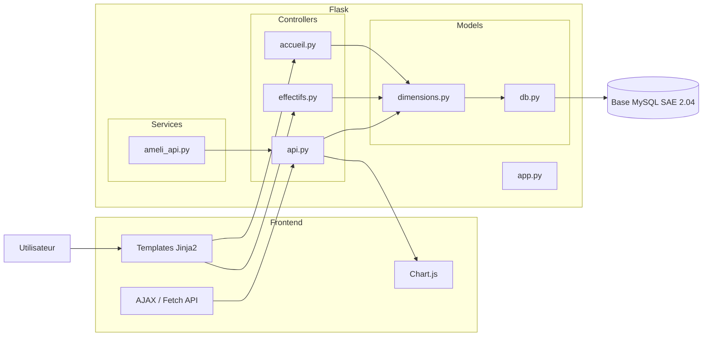

# SAE 2.01 - Développement d'une Application Web Flask

## Présentation

Cette SAE (Situation d'aprentissage évalué, ie un projet académique) consiste à développer une application web complète à partir de la base de données réalisée lors de la SAE 2.04.

L'application permet d'exploiter des données de l'Assurance Maladie à travers une interface web interactive intégrant :

- Consultation de données statistiques
- Visualisations graphiques dynamiques
- Comparaison de territoires
- Export CSV
- API REST JSON
- Architecture MVC

## Objectifs pédagogiques

- Mettre en œuvre une architecture MVC
- Développer une application web avec Flask
- Utiliser SQLAlchemy pour l'accès aux données
- Créer des interfaces dynamiques avec Jinja2
- Exploiter AJAX et les routes JSON
- Produire des visualisations avec Chart.js
- Déployer une application sur Alwaysdata

---

## Technologies utilisées

- Python 3
- Flask 3
- SQLAlchemy
- Jinja2
- HTML5
- CSS3
- JavaScript
- AJAX / Fetch API
- Chart.js
- MySQL
- Alwaysdata

---

## Structure du projet

## Architecture de l'application



---

## Fonctionnalités

### Consultation des données

- Sélection d'une région
- Sélection d'un département
- Affichage des effectifs
- Affichage des honoraires
- Consultation des indicateurs disponibles

### Cascade AJAX

Lorsqu'une région est sélectionnée :

1. Un appel AJAX est effectué.
2. Flask retourne les départements correspondants.
3. La liste des départements est mise à jour sans rechargement de page.

### Visualisations Chart.js

#### Courbe d'évolution

- Évolution des effectifs dans le temps
- Affichage dynamique des données

#### Diagramme circulaire

- Répartition des honoraires
- Analyse des catégories

#### Comparaison multi-séries

- Comparaison entre deux territoires
- Affichage simultané sur un même graphique

### API REST

Routes JSON permettant d'alimenter les graphiques :

```http
GET /api/departements/<id_region>
GET /api/effectifs/<id_departement>
GET /api/honoraires/<id_departement>
```

### Export CSV

Téléchargement des résultats sous format CSV.

Exemple :

```csv
Annee,Effectif
2018,1200
2019,1350
2020,1400
```

---

## Installation

### Cloner le projet

```bash
git clone <url-du-projet>
cd SAE201-code
```

### Créer un environnement virtuel

Linux / MacOS :

```bash
python3 -m venv venv
source venv/bin/activate
```

Windows :

```bash
python -m venv venv
venv\Scripts\activate
```

### Installer les dépendances

```bash
pip install -r requirements.txt
```

---

## Configuration

Créer les variables d'environnement :

```env
FLASK_ENV=development

DB_USER=user
DB_PASSWORD=password
DB_HOST=localhost
DB_NAME=sae204

SECRET_KEY=cle_secrete
```

---

## Lancement de l'application

```bash
python app.py
```

L'application sera accessible à l'adresse :

```text
http://localhost:5000
```

---

## Déploiement Alwaysdata

### Préparation

- Créer un environnement virtuel
- Installer les dépendances
- Configurer les variables d'environnement
- Ajouter le fichier WSGI

### Exemple de fichier wsgi.py

```python
from app import app

application = app
```

### Configuration du site

- Répertoire de l'application : `/www/sae201_xx`
- Interpréteur Python : `venv/bin/python`
- Fichier WSGI : `wsgi.py`

---

## Difficultés rencontrées

- Mise en place de l'architecture MVC
- Gestion des routes JSON
- Communication AJAX
- Création des graphiques Chart.js
- Déploiement sur Alwaysdata

---

## Améliorations possibles

- Authentification utilisateur
- Export PDF
- Tableau de bord avancé
- Filtres supplémentaires
- Responsive Design complet
- Mise en cache des données

---

## Compétences développées

### Développement Web

- Flask
- Jinja2
- Architecture MVC
- Blueprints

### Front-End

- HTML/CSS
- JavaScript
- AJAX
- Chart.js

### Bases de données

- SQLAlchemy
- MySQL
- ORM

### Déploiement

- Alwaysdata
- WSGI
- Gestion d'environnement Python

---

## Auteurs

Projet réalisé dans le cadre de la SAE 2.01 du BUT Informatique.

Année universitaire : 2025-2026

IUT de Créteil-Vitry
Département Informatique

---

## Licence

Projet pédagogique réalisé dans le cadre de la formation BUT Informatique.